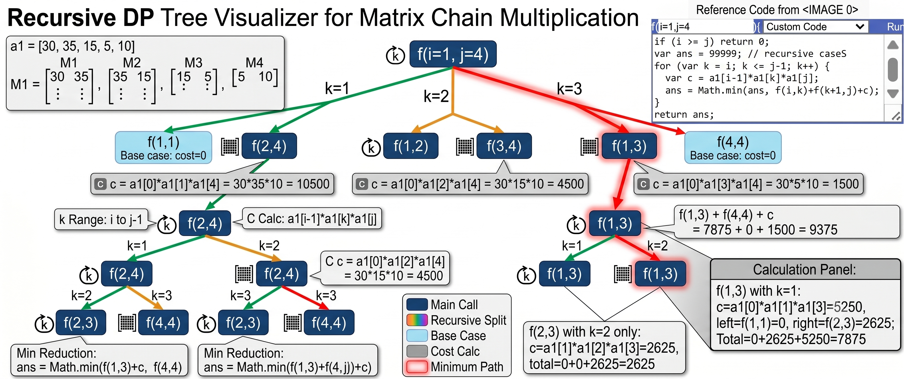

# Matrix Chain Multiplication (MCM) - Intuition & Recursion Tree

This document breaks down the recursive Matrix Chain Multiplication algorithm using straightforward technical logic, making it easy to review for competitive programming or algorithm practice.

## 1. The Core Variables Explained

* **`i` and `j` (The Window):** These define the boundaries of your current subproblem. `f(1, 4)` means "calculate the minimum cost to multiply matrices from index 1 to 4."
  * **Base Case (`i >= j`):** If you are looking at a single matrix (e.g., `f(2, 2)`), no multiplication is happening. The cost is exactly `0`.

* **`k` (The Split Point):** The `for` loop runs from `k = i` to `k = j - 1`. `k` is the exact index where you divide the current window into two smaller sub-windows (left and right).

* **`c` (The Merging Cost):** The computational cost to multiply the *resulting matrix* of the left sub-window with the *resulting matrix* of the right sub-window. 
  * **Formula:** `c = a1[i-1] * a1[k] * a1[j]`
  * **When is it calculated?** `c` is *only* calculated inside the `for` loop when a split actually happens. It is never calculated for the base case.

---

## 2. Why `ans` Must Be a Local Variable

```javascript
var ans = 99999; 
```
Every recursive call to `f(i, j)` is calculating the minimum for its own specific window. 

If `ans` were a global variable, deeper recursive calls (like `f(1, 2)`) would overwrite the `ans` value that the higher-level calls (like `f(1, 4)`) are currently using to compare paths. By declaring `var ans` locally, every subproblem gets its own independent memory space in the call stack to track its local minimum. `99999` just acts as a placeholder for infinity so the first valid path safely replaces it.

---

## 3. Recursion Tree Example: `f(1, 3)`

Here is a visual representation of how the tree branches out when evaluating 3 matrices.

```text
                                  f(1, 3)
                                  /       \
                        [k=1]   /         \   [k=2]
                                /           \
                    f(1,1) + f(2,3) + c    f(1,2) + f(3,3) + c
                              /     \           /     \
                        [k=2]       \         /       [k=1]
                        /            \       /            \
              f(2,2)+f(3,3)+c         (0)   (0)        f(1,1)+f(2,2)+c
```

---

## 4. The Execution Call Stack (Step-by-Step)

Using the array `a1 = [30, 35, 15, 5]`. Let's trace `f(1, 3)`.

### Path 1: Splitting at `k = 1`
1. The left side is `f(1, 1)`. This hits the base case and returns `0`.
2. The right side is `f(2, 3)`. This triggers a new subproblem loop (where `k = 2`).
   * `f(2, 3)` splits into `f(2, 2)` (returns `0`) and `f(3, 3)` (returns `0`).
   * Calculate local `c` for `f(2, 3)`: `35 * 15 * 5 = 2625`.
   * `f(2, 3)` finishes and returns `2625`.
3. Calculate the root merging cost `c` for `k = 1`: `30 * 35 * 5 = 5250`.
4. **Path 1 Total:** `0 + 2625 + 5250 = 7875`.

### Path 2: Splitting at `k = 2`
1. The left side is `f(1, 2)`. This triggers a new subproblem loop (where `k = 1`).
   * `f(1, 2)` splits into `f(1, 1)` (returns `0`) and `f(2, 2)` (returns `0`).
   * Calculate local `c` for `f(1, 2)`: `30 * 35 * 15 = 15750`.
   * `f(1, 2)` finishes and returns `15750`.
2. The right side is `f(3, 3)`. This hits the base case and returns `0`.
3. Calculate the root merging cost `c` for `k = 2`: `30 * 15 * 5 = 2250`.
4. **Path 2 Total:** `15750 + 0 + 2250 = 18000`.

### Final Decision 
The `for` loop finishes exploring all `k` values. The function calculates `Math.min(7875, 18000)` and returns **`7875`**.


---

## 5.  Example with recursion tree

